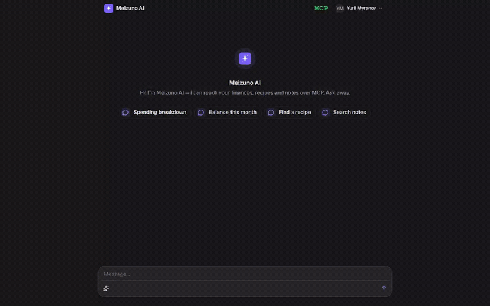

# AI Chat

<p align="center">
  <br>
  <sub>▶ <a href="preview/demo.mp4">full-resolution MP4</a></sub>
</p>

A self-hosted chat shell over OpenAI with MCP-driven tool calling. The model
streams completions while the configured **MCP servers** (notes, money
manager, recipes, …) expose typed tools that the model invokes mid-stream.
Suggested-prompt buttons can either fill the input or fetch a structured
payload (chart, list, detail view) that the chat renders as a custom
markdown block. Auth is delegated; ai-chat owns no records — it's a thin
shell over `@ai-sdk/openai`, `@modelcontextprotocol/sdk`, and an external
auth service.

## Stack

- **[Nuxt 4](https://nuxt.com)** (Vue 3, `<script setup>`) + **Nitro** server
- **[@ai-sdk/openai](https://sdk.vercel.ai)** + **[@ai-sdk/vue](https://sdk.vercel.ai)** for streamed completions
- **[@modelcontextprotocol/sdk](https://modelcontextprotocol.io)** for tool servers (connection-pooled per user)
- **[@nuxt/ui](https://ui.nuxt.com)** + **[@nuxtjs/mdc](https://github.com/nuxt-modules/mdc)** for Markdown / custom Prose blocks
- **zod** for request validation, **Vitest** for tests, **pnpm** as the package manager
- Auth is **delegated to an external auth service** — this app validates and
  refreshes tokens, it does not issue them.

The architecture (thin handlers → zod boundary → service layer → external
upstream, with a typed domain-error taxonomy and fail-fast env validation)
is documented for contributors and AI agents in **[CLAUDE.md](CLAUDE.md)**.

## Prerequisites

- **Node 22+** and **pnpm** (see `packageManager` in `package.json`)
- An **OpenAI** API key (or compatible upstream)
- A reachable **auth service** exposing `/validate` and `/refresh`
- One or more **MCP servers** (configured via `config.yml`)

## Environment

Configure via `NUXT_`-prefixed env vars (mapped to `runtimeConfig`). Required
env is validated at startup — the server **exits** if it's missing or invalid
(`server/plugins/validate-env.ts`).

| Variable | Required | Purpose |
|---|---|---|
| `NUXT_OPENAI_API_KEY` | ✅ | OpenAI (or compatible) API key |
| `NUXT_AUTH_SERVICE_URL` | ✅ | Base URL of the external auth service |

MCP servers are authenticated with the signed-in user's Bearer access token
(forwarded from the session), so no shared MCP key is required.

The MCP server list, system prompt, default messaging, and pricing block all
live in `config.yml` (mount it into the container; see `config.yml.example`).

## Setup

```sh
pnpm install                 # also runs: nuxt prepare
cp config.yml.example config.yml
pnpm run dev                 # http://localhost:3000
```

## Scripts

| Task | Command |
|---|---|
| Dev server | `pnpm run dev` |
| Build | `pnpm run build` |
| Preview prod build | `pnpm run preview` |
| Typecheck | `pnpm run typecheck` (`nuxt typecheck`) |
| Lint | `pnpm run lint` (`eslint .`) |
| Test | `pnpm run test` · watch: `pnpm run test:watch` |

`typecheck`, `lint`, and `test` are the verification gate — keep all three
green before committing. CI runs the same three on every push and pull
request; the `/verify` skill runs them locally in one shot.

## Project structure

```
app/         CLIENT — pages (thin), components (dumb: AppChat, ChatPrompt, Prose*),
             composables (useAuth, useMcpStatus, useUsage, usePullToRefresh)
server/
  api/       thin HTTP handlers (parse → validate → service → return)
  services/  business logic (chat, mcp, config, prompts)
  utils/     auto-imported helpers — auth, errors, env, mcp-client, mcp-config
  middleware/ auth gate, request logging, prod page cache
  plugins/   startup hooks (env validation)
  types/     H3EventContext augmentation
shared/      cross-cutting zod schemas + types (#shared), client + server
config.yml   MCP server list + system prompt + defaults + pricing
test/        mirrors source (test/server/**, test/shared/**)
.claude/skills/  /git-commit, /git-push, /git-sync, /verify
```

## Testing

Vitest with `@nuxt/test-utils`. Tests default to a node environment; opt into
the Nuxt runtime per-file with `// @vitest-environment nuxt`. Schema tests
and error-taxonomy tests run without HTTP or upstream calls.

```sh
pnpm run test
```

## Deployment

CI ([.github/workflows/deploy.yml](.github/workflows/deploy.yml)):

1. **verify** — typecheck + lint + test (every push and PR).
2. **build-and-push** — builds the Docker image and pushes it to GHCR (main / tags only).
3. **deploy** — pulls the image and restarts the service on the VPS via Compose.

The container serves the Nitro build directly. A `/api/health` endpoint
backs the Docker healthcheck.
