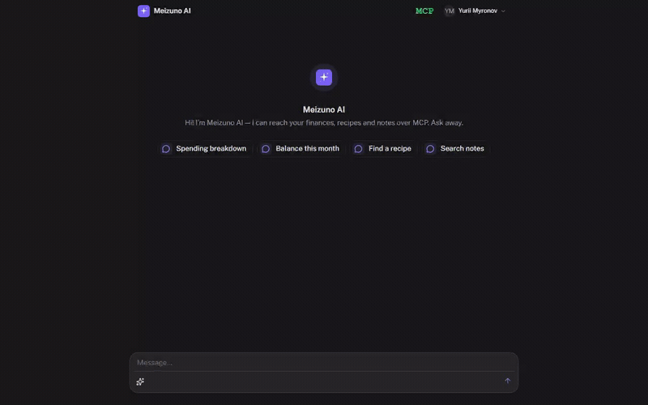

# AI Chat

<p align="center">
  <br>
  <sub>▶ <a href="preview/demo.mp4">full-resolution MP4</a></sub>
</p>

A self-hosted chat shell over OpenAI with MCP-driven tool calling. The model
streams completions while each user's own **MCP servers** — added at runtime —
expose typed tools it invokes mid-stream, and it can emit chart and diagram
blocks the chat renders as custom Markdown. Auth is delegated to an external
service, but ai-chat is **not stateless**: it persists **per-user data in
Postgres via Prisma** — chat history (`Chat`, `Message`), image attachments
stored as `bytea` (`Attachment`), each user's MCP servers (`McpServer`), and
per-user settings (`Setting`).

## Stack

- **[Nuxt 4](https://nuxt.com)** (Vue 3, `<script setup>`) + **Nitro** server
- **[@ai-sdk/openai](https://sdk.vercel.ai)** + **[@ai-sdk/vue](https://sdk.vercel.ai)** for streamed completions
- **[@modelcontextprotocol/sdk](https://modelcontextprotocol.io)** for tool servers (connection-pooled per user)
- **[@nuxt/ui](https://ui.nuxt.com)** + **[@nuxtjs/mdc](https://github.com/nuxt-modules/mdc)** for Markdown / custom Prose blocks
- **zod** for request validation, **Vitest** for tests, **pnpm** as the package manager
- Auth is **delegated to an external auth service** — this app validates and
  refreshes tokens, it does not issue them.

The architecture (thin handlers → zod boundary → service layer → external
upstream, with a typed domain-error taxonomy and fail-fast env validation)
is documented for contributors and AI agents in **[CLAUDE.md](CLAUDE.md)**.

## Prerequisites

- **Node 22+** and **pnpm** (see `packageManager` in `package.json`)
- A **PostgreSQL** database (chat history, attachments, MCP servers, settings)
- An **OpenAI** API key (or compatible upstream)
- A reachable **auth service** exposing `/validate` and `/refresh`
- Optionally, **MCP servers** to connect — each user adds their own at runtime
  in Settings (nothing is configured ahead of time)

## Environment

Configure via `NUXT_`-prefixed env vars (mapped to `runtimeConfig`). Required
env is validated at startup — the server **exits** if it's missing or invalid
(`server/plugins/validate-env.ts`).

| Variable | Required | Purpose |
|---|---|---|
| `NUXT_OPENAI_API_KEY` | ✅ | OpenAI (or compatible) API key |
| `NUXT_AUTH_SERVICE_URL` | ✅ | Base URL of the external auth service |
| `NUXT_DATABASE_URL` | ✅ | PostgreSQL connection string (Prisma) — the server exits without it |
| `NUXT_MOCK_AI` | – | Dev only: `1`/`true` streams a canned reply instead of calling OpenAI |

MCP servers are authenticated with the signed-in user's Bearer access token
(forwarded from the session), so no shared MCP key is required.

There is no config file. The completion model and system prompt are constants
in `server/utils/constants.ts`; the bot name, welcome message, and token pricing
are in `app/constants.ts`. The MCP server list and suggested prompts are
per-user, stored in Postgres and managed in Settings (see below).

## Per-user configuration

Each user configures the app at runtime from **Settings**, persisted per-user in
Postgres — there is no shared config:

- **MCP servers** (`McpServer`) — add your own MCP server URLs; their tools are
  fetched live each turn. A per-server toggle decides whether your SSO token is
  forwarded to that server.
- **Suggested prompts** (`Setting.suggestedPrompts`) — starter prompts shown on
  the welcome screen and the prompt picker.
- **Profile** (`Setting.profileUrl`) — a public `llms.txt`-style URL the server
  fetches and prepends (fenced as untrusted reference data) to your system
  prompt, so the assistant knows who it works for. Cached per URL for one hour.

## Setup

```sh
pnpm install                 # also runs: nuxt prepare && prisma generate
# set NUXT_DATABASE_URL (+ the other required env), then apply migrations:
pnpm run prisma:migrate
pnpm run dev                 # http://localhost:3000
```

## Scripts

| Task | Command |
|---|---|
| Dev server | `pnpm run dev` |
| Build | `pnpm run build` |
| Preview prod build | `pnpm run preview` |
| Typecheck | `pnpm run typecheck` (`nuxt typecheck`) |
| Lint | `pnpm run lint` (`eslint .`) |
| Test | `pnpm run test` · watch: `pnpm run test:watch` |
| Prisma client | `pnpm run prisma:generate` |
| DB migrations | `pnpm run prisma:migrate` (`prisma migrate dev`) |

`typecheck`, `lint`, and `test` are the verification gate — keep all three
green before committing. CI runs the same three on every push and pull
request; the `/verify` skill runs them locally in one shot.

## Project structure

```
app/         CLIENT — layouts, pages (thin), components (AppSidebar, ChatWorkspace,
             Prose*), composables (useConversations, useSettings, useMcpServers,
             useMcpStatus, useAuth, useUsage), constants.ts
server/
  api/       thin HTTP handlers (parse → validate → service → return)
  services/  business logic (chat, mcp, prompts)
  utils/     auto-imported helpers — auth, errors, env, constants, mcp-client,
             mcp-servers, chats, attachments, settings, profile
  middleware/ auth gate, request logging
  plugins/   startup hooks (env validation)
  types/     H3EventContext augmentation
shared/      cross-cutting zod schemas + types (#shared), client + server
prisma/      schema.prisma (Chat, Message, McpServer, Setting, Attachment) +
             migrations; entrypoint.sh runs `prisma migrate deploy` on start
test/        mirrors source (test/server/**, test/shared/**)
.claude/skills/  /git-commit, /git-push, /git-sync, /verify
```

## Testing

Vitest with `@nuxt/test-utils`. Tests default to a node environment; opt into
the Nuxt runtime per-file with `// @vitest-environment nuxt`. Schema tests
and error-taxonomy tests run without HTTP or upstream calls.

```sh
pnpm run test
```

## Deployment

CI ([.github/workflows/deploy.yml](.github/workflows/deploy.yml)):

1. **verify** — typecheck + lint + test (every push and PR).
2. **build-and-push** — builds the Docker image and pushes it to GHCR (main / tags only).
3. **deploy** — pulls the image and restarts the service on the VPS via Compose.

The container serves the Nitro build directly. A `/api/health` endpoint
backs the Docker healthcheck.
